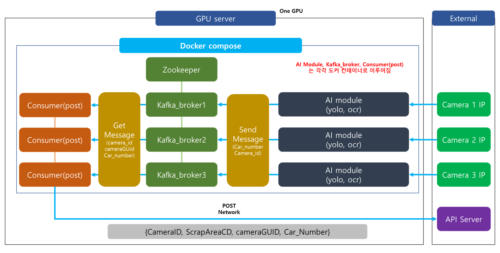

# YOLOv7 + EASY OCR
* yolov7 모델과 easy ocr 모델 결합
* kafka 이용한 메시지 통신 방식
  
* post로 서버 전송 가능

***
# Use
* 모듈 사용 시
  > python main.py -c "camera_path"
* POST 통신과 사용 시
  > python main_send_post.py -c "camera path"
***
## Use Docker
1. 도커 및 도커 컴포즈 설치
2. 도커 컴포즈 실행
> * docker-compose -f docker-compose2.yml up -d
3. (optional) 필요 시 도커 파일 수정
> * consumer.Dockerfile -> Consumer 역할 
> * model.Dockerfile -> Producer 역할
4. 컴포즈 완료 후 도커는 총 10개의 컨테이너로 구성
> * zookeeper
> * kafka-broker (3개) - 브로커 당 하나의 토픽이 존재
> * consumer (3개) - 각 컨테이너 당 하나의 브로커와 통신
> * producer (3개) - 각 컨테이너 당 하나의 카메라가 연결, 및 브로커와 통신
5. Docker-compose
* Command
> * Command 는 docker-compose 안 command 라인에 있음
* model 사용 컨테이너
> * service name -> yolo_ocr
> * command -> python3 kafka_producer.py -c "camera_path" -bs kafka:"port" -t "topic_name"
> * command option
> > -c : camera_path, -bs : bootstrap server, -t : topic name
* post 통신 컨테이너
> * service name -> consumer
> * command -> python3 post_consumer.py -bs kafka:"port" -t "topic_name"
> * command option
> > -bs : bootstrap server, -t : topic name 

***
## Requirements
* model.Dockerfile
> com/requirements_model.txt
* consumer.Dockerfile
> com/requirements_consumer.txt

* EasyOCR
>pip install easyocr
 
***
## Open Source URL
* yolov7 모델 requirements
  >[yolov7-u7](https://github.com/WongKinYiu/yolov7/tree/u7)
* easy ocr 모델 requirements
  >[easyocr](https://github.com/JaidedAI/EasyOCR)

***
## warning
* easy ocr 사용 시 opencv 버전에 따라 안되는 것이 있음. 최신버전 사용
* opencv-python-4.7.0.68 구동확인